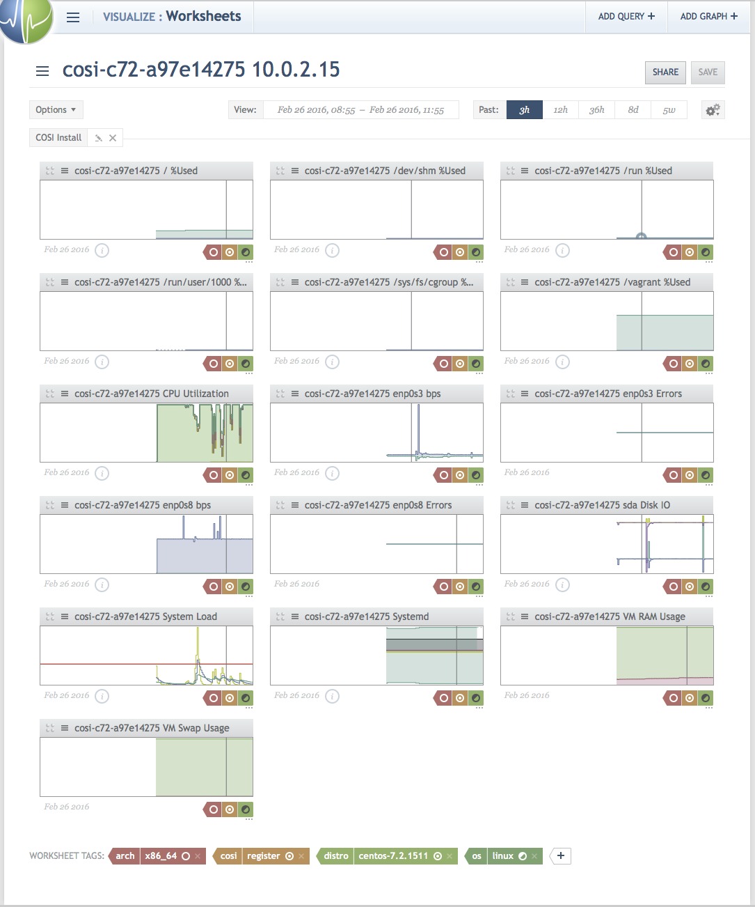

# CentOS 7.2

* [Install](#Install)
* [Worksheet](#Worksheet)
* [Destroy](#Destroy)

## Install

```sh

```

```sh
⁖ vagrant up centos7.2
Bringing machine 'centos7.2' up with 'virtualbox' provider...
==> centos7.2: Importing base box 'maier/centos-7.2.1511-x86_64'...
==> centos7.2: Matching MAC address for NAT networking...
==> centos7.2: Checking if box 'maier/centos-7.2.1511-x86_64' is up to date...
==> centos7.2: Setting the name of the VM: example_centos72_1456500684648_89294
==> centos7.2: Fixed port collision for 22 => 2222. Now on port 2200.
==> centos7.2: Clearing any previously set network interfaces...
==> centos7.2: Preparing network interfaces based on configuration...
    centos7.2: Adapter 1: nat
    centos7.2: Adapter 2: hostonly
==> centos7.2: Forwarding ports...
    centos7.2: 22 (guest) => 2200 (host) (adapter 1)
==> centos7.2: Booting VM...
==> centos7.2: Waiting for machine to boot. This may take a few minutes...
    centos7.2: SSH address: 127.0.0.1:2200
    centos7.2: SSH username: vagrant
    centos7.2: SSH auth method: private key
    centos7.2: Warning: Remote connection disconnect. Retrying...
    centos7.2: Warning: Remote connection disconnect. Retrying...
    centos7.2: Warning: Remote connection disconnect. Retrying...
    centos7.2:
    centos7.2: Vagrant insecure key detected. Vagrant will automatically replace
    centos7.2: this with a newly generated keypair for better security.
    centos7.2:
    centos7.2: Inserting generated public key within guest...
    centos7.2: Removing insecure key from the guest if it's present...
    centos7.2: Key inserted! Disconnecting and reconnecting using new SSH key...
==> centos7.2: Machine booted and ready!
==> centos7.2: Checking for guest additions in VM...
==> centos7.2: Setting hostname...
==> centos7.2: Configuring and enabling network interfaces...
==> centos7.2: Mounting shared folders...
    centos7.2: /vagrant => /.../circonus-one-step-install/example
==> centos7.2: Running provisioner: ansible...
    centos7.2: Running ansible-playbook...

PLAY ***************************************************************************

TASK [setup] *******************************************************************
ok: [centos7.2]

TASK [os : debug] **************************************************************
ok: [centos7.2] => {
    "msg": "OS RedHat CentOS v7.2.1511 x86_64"
}

TASK [os : Common variables] ***************************************************
ok: [centos7.2]

TASK [os : OS Specific variables] **********************************************

TASK [os : Common tasks] *******************************************************
included: /.../circonus-one-step-install/example/provision/roles/os/tasks/common.yml for centos7.2

TASK [os : Install perl (NAD requires it)] *************************************
changed: [centos7.2]

TASK [os : OS Specific tasks] **************************************************

TASK [cosi : Common variables] *************************************************
ok: [centos7.2]

TASK [cosi : OS Specific variables] ********************************************

TASK [cosi : Common tasks] *****************************************************
included: /.../circonus-one-step-install/example/provision/roles/cosi/tasks/common.yml for centos7.2

TASK [cosi : Verify COSI directory] ********************************************
changed: [centos7.2]

TASK [cosi : OS Specific tasks] ************************************************
included: /.../circonus-one-step-install/example/provision/roles/cosi/tasks/CentOS-7.yml for centos7.2

TASK [cosi : Install POST Agent Install hook directory] ************************
changed: [centos7.2]

TASK [cosi : Install POST Agent Install hook script] ***************************
changed: [centos7.2]

TASK [cosi : Install POST Agent Install hook assets] ***************************
changed: [centos7.2] => (item=/.../circonus-one-step-install/example/provision/roles/cosi/files/hooks/CentOS/7/scripts/df.sh)
changed: [centos7.2] => (item=/.../circonus-one-step-install/example/provision/roles/cosi/files/hooks/CentOS/7/scripts/load.sh)
changed: [centos7.2] => (item=/.../circonus-one-step-install/example/provision/roles/cosi/files/hooks/CentOS/7/scripts/vm.sh)

TASK [cosi : COSI Install tasks] ***********************************************
included: /.../circonus-one-step-install/example/provision/roles/cosi/tasks/install.yml for centos7.2

TASK [cosi : Download COSI installer script] ***********************************
changed: [centos7.2]

TASK [cosi : Check COSI installer script] **************************************
changed: [centos7.2]

TASK [cosi : Run COSI installer] ***********************************************
changed: [centos7.2]

TASK [cosi : debug] ************************************************************
ok: [centos7.2] => {
    "msg": [
        "Started Circonus One step Install on Fri Feb 26 15:33:02 UTC 2016",
        "Initializing cosi-install",
        "Parsing command line parameters",
        "Verifying COSI support for OS",
        "\tAttempt RedHat(variant) detection",
        "\tLooking up Linux CentOS v7.2.1511 x86_64.",
        "\u001b[32m\tCentOS 7.2.1511 x86_64 supported!",
        "\u001b[0mCheck NAD state",
        "Downloading Agent package http://updates.circonus.net/node-agent/packages/nad-omnibus-20150422T174727Z-1.el7.x86_64.rpm",
        "Installing agent package /opt/circonus/cosi/cache/nad-omnibus-20150422T174727Z-1.el7.x86_64.rpm",
        "Preparing packages...",
        "nad-omnibus-20150422T174727Z-1.el7.x86_64",
        "Agent POST hook found, running...",
        "Stopping nad (via systemctl):  [  OK  ]",
        "‘/opt/circonus/cosi/hooks/df.sh’ -> ‘/opt/circonus/etc/node-agent.d/linux/df.sh’",
        "‘/opt/circonus/cosi/hooks/vm.sh’ -> ‘/opt/circonus/etc/node-agent.d/linux/vm.sh’",
        "‘/opt/circonus/cosi/hooks/load.sh’ -> ‘/opt/circonus/etc/node-agent.d/linux/load.sh’",
        "Starting nad (via systemctl):  [  OK  ]",
        "Starting installed agent (if not already running)",
        "Starting nad (via systemctl):  [  OK  ]",
        "\u001b[32mAgent running with PID 12058",
        "\u001b[0m",
        "Retrieving COSI registration utilities https://setup.circonus.com/utils",
        "",
        "Installing required node modules for COSI registration utilities",
        "",
        "Saving COSI registration configuration /opt/circonus/etc/cosi.json",
        "",
        "Running COSI registration script",
        "INFO: Starting COSI Registration",
        "INFO: Verifying Circonus API key",
        "INFO: API key validated for account 'maier' ",
        "INFO: Requesting list of brokers from Circonus API",
        "INFO: Retrieved list of known brokers",
        "INFO: Checking for Enterprise brokers",
        "INFO: Identified default broker: 35",
        "INFO: Using Circonus Broker 35",
        "INFO: Fetching available metrics from agent http://127.0.0.1:2609/",
        "INFO: Available metrics saved as /opt/circonus/cosi/registration/available-metrics.json",
        "INFO: Fetching template https://setup.circonus.com/config/system?dist=CentOS&vers=7.2.1511&arch=x86_64&type=Linux&mode=push",
        "INFO: Fetching template https://setup.circonus.com/template/df?dist=CentOS&vers=7.2.1511&arch=x86_64&type=Linux&mode=push",
        "INFO: Fetching template https://setup.circonus.com/template/load?dist=CentOS&vers=7.2.1511&arch=x86_64&type=Linux&mode=push",
        "INFO: Fetching template https://setup.circonus.com/template/systemd?dist=CentOS&vers=7.2.1511&arch=x86_64&type=Linux&mode=push",
        "INFO: Fetching template https://setup.circonus.com/template/disk?dist=CentOS&vers=7.2.1511&arch=x86_64&type=Linux&mode=push",
        "INFO: Fetching template https://setup.circonus.com/template/if?dist=CentOS&vers=7.2.1511&arch=x86_64&type=Linux&mode=push",
        "INFO: Fetching template https://setup.circonus.com/template/vm?dist=CentOS&vers=7.2.1511&arch=x86_64&type=Linux&mode=push",
        "INFO: Fetching template https://setup.circonus.com/template/cpu?dist=CentOS&vers=7.2.1511&arch=x86_64&type=Linux&mode=push",
        "INFO: Metric group 'df' graph template(s) loaded /opt/circonus/cosi/registration/template-graph-df.json",
        "INFO: Parsing graph template df-0",
        "INFO: Done loading & parsing graph template(s) for metric category 'df'",
        "INFO: Metric group 'load' graph template(s) loaded /opt/circonus/cosi/registration/template-graph-load.json",
        "INFO: Parsing graph template load-0",
        "INFO: Done loading & parsing graph template(s) for metric category 'load'",
        "INFO: Metric group 'systemd' graph template(s) loaded /opt/circonus/cosi/registration/template-graph-systemd.json",
        "INFO: Parsing graph template systemd-0",
        "INFO: Done loading & parsing graph template(s) for metric category 'systemd'",
        "INFO: Metric group 'disk' graph template(s) loaded /opt/circonus/cosi/registration/template-graph-disk.json",
        "INFO: Parsing graph template disk-0",
        "INFO: Done loading & parsing graph template(s) for metric category 'disk'",
        "INFO: Metric group 'if' graph template(s) loaded /opt/circonus/cosi/registration/template-graph-if.json",
        "INFO: Parsing graph template if-0",
        "INFO: Parsing graph template if-1",
        "INFO: Done loading & parsing graph template(s) for metric category 'if'",
        "INFO: Metric group 'vm' graph template(s) loaded /opt/circonus/cosi/registration/template-graph-vm.json",
        "INFO: Parsing graph template vm-0",
        "INFO: Parsing graph template vm-1",
        "INFO: Done loading & parsing graph template(s) for metric category 'vm'",
        "INFO: Metric group 'cpu' graph template(s) loaded /opt/circonus/cosi/registration/template-graph-cpu.json",
        "INFO: Parsing graph template cpu-0",
        "INFO: Done loading & parsing graph template(s) for metric category 'cpu'",
        "INFO: Graph templates loaded:  df-0, load-0, systemd-0, disk-0, if-0, if-1, vm-0, vm-1, cpu-0",
        "INFO: Creating check.",
        "INFO: Creating a check configuration for this system",
        "INFO: Loading default check configuration template",
        "INFO: Loaded Generic default configuration for CentOS v1.0.0 /opt/circonus/cosi/registration/template-check.json",
        "INFO: Setting default check configuration options",
        "INFO: Done setting default check options",
        "INFO: Setting custom check configuration options",
        "INFO: Adding available metrics to check configuration",
        "INFO: Added 80 metrics to check configuration",
        "INFO: Activating metrics required by graph template(s)",
        "INFO: Activating metric df`/`pct_used",
        "INFO: Activating metric df`/`pct_inode_used",
        "INFO: Activating metric df`/dev/shm`pct_used",
        "INFO: Activating metric df`/dev/shm`pct_inode_used",
        "INFO: Activating metric df`/run`pct_used",
        "INFO: Activating metric df`/run`pct_inode_used",
        "INFO: Activating metric df`/sys/fs/cgroup`pct_used",
        "INFO: Activating metric df`/sys/fs/cgroup`pct_inode_used",
        "INFO: Activating metric df`/run/user/1000`pct_used",
        "INFO: Activating metric df`/run/user/1000`pct_inode_used",
        "INFO: Activating metric df`/vagrant`pct_used",
        "INFO: Activating metric df`/vagrant`pct_inode_used",
        "INFO: Activating metric load`1min",
        "INFO: Activating metric load`5min",
        "INFO: Activating metric load`15min",
        "INFO: Activating metric systemd`load`not-found",
        "INFO: Activating metric systemd`load`masked",
        "INFO: Activating metric systemd`load`loaded",
        "INFO: Activating metric systemd`load`error",
        "INFO: Activating metric systemd`state`reloading",
        "INFO: Activating metric systemd`state`inactive",
        "INFO: Activating metric systemd`state`failed",
        "INFO: Activating metric systemd`state`deactivating",
        "INFO: Activating metric systemd`state`active",
        "INFO: Activating metric systemd`state`activating",
        "INFO: Activating metric disk`sda`reads",
        "INFO: Activating metric disk`sda`writes",
        "INFO: Activating metric disk`sda`nread",
        "INFO: Activating metric disk`sda`nwritten",
        "INFO: Activating metric if`enp0s3`in_bytes",
        "INFO: Activating metric if`enp0s3`in_errors",
        "INFO: Activating metric if`enp0s3`out_bytes",
        "INFO: Activating metric if`enp0s3`out_errors",
        "INFO: Activating metric if`enp0s8`in_bytes",
        "INFO: Activating metric if`enp0s8`in_errors",
        "INFO: Activating metric if`enp0s8`out_bytes",
        "INFO: Activating metric if`enp0s8`out_errors",
        "INFO: Activating metric vm`memory`used",
        "INFO: Activating metric vm`memory`free",
        "INFO: Activating metric vm`swap`used",
        "INFO: Activating metric vm`swap`free",
        "INFO: Activating metric cpu`user",
        "INFO: Activating metric cpu`kernel",
        "INFO: Activating metric cpu`idle",
        "INFO: Activating metric cpu`wait_io",
        "INFO: Activating metric cpu`intr",
        "INFO: Activated 46 metrics",
        "INFO: Saved check configuration /opt/circonus/cosi/registration/config-check.json",
        "INFO: Calling Circonus API to create check for this system",
        "INFO: Saved check registration /opt/circonus/cosi/registration/registration-check.json",
        "INFO: Created NAD Agent push config /opt/circonus/etc/nad-push.json",
        "INFO: Creating graphs.",
        "INFO: Creating configuration(s) for graph df-0",
        "INFO: Require metrics matching df`([^`]+)`pct_used",
        "INFO: Found metric df`/`pct_used",
        "INFO: Found metric df`/dev/shm`pct_used",
        "INFO: Found metric df`/run/user/1000`pct_used",
        "INFO: Found metric df`/run`pct_used",
        "INFO: Found metric df`/sys/fs/cgroup`pct_used",
        "INFO: Found metric df`/vagrant`pct_used",
        "INFO: Require metrics matching df`([^`]+)`pct_inode_used",
        "INFO: Found metric df`/`pct_inode_used",
        "INFO: Found metric df`/dev/shm`pct_inode_used",
        "INFO: Found metric df`/run/user/1000`pct_inode_used",
        "INFO: Found metric df`/run`pct_inode_used",
        "INFO: Found metric df`/sys/fs/cgroup`pct_inode_used",
        "INFO: Found metric df`/vagrant`pct_inode_used",
        "INFO: Saved graph configuration /opt/circonus/cosi/registration/config-graph-df-0-_.json",
        "INFO: Saved graph configuration /opt/circonus/cosi/registration/config-graph-df-0-_dev_shm.json",
        "INFO: Saved graph configuration /opt/circonus/cosi/registration/config-graph-df-0-_run_user_1000.json",
        "INFO: Saved graph configuration /opt/circonus/cosi/registration/config-graph-df-0-_run.json",
        "INFO: Saved graph configuration /opt/circonus/cosi/registration/config-graph-df-0-_sys_fs_cgroup.json",
        "INFO: Saved graph configuration /opt/circonus/cosi/registration/config-graph-df-0-_vagrant.json",
        "INFO: Creating configuration for graph load-0",
        "INFO: Verifying required metrics",
        "INFO: Require metric load`1min",
        "INFO: Found metric load`1min",
        "INFO: Require metric load`5min",
        "INFO: Found metric load`5min",
        "INFO: Require metric load`15min",
        "INFO: Found metric load`15min",
        "INFO: Saved graph configuration /opt/circonus/cosi/registration/config-graph-load-0.json",
        "INFO: Creating configuration for graph systemd-0",
        "INFO: Verifying required metrics",
        "INFO: Require metric systemd`state`failed",
        "INFO: Found metric systemd`state`failed",
        "INFO: Require metric systemd`state`inactive",
        "INFO: Found metric systemd`state`inactive",
        "INFO: Require metric systemd`state`reloading",
        "INFO: Found metric systemd`state`reloading",
        "INFO: Require metric systemd`state`deactivating",
        "INFO: Found metric systemd`state`deactivating",
        "INFO: Require metric systemd`state`activating",
        "INFO: Found metric systemd`state`activating",
        "INFO: Require metric systemd`state`active",
        "INFO: Found metric systemd`state`active",
        "INFO: Require metric systemd`load`loaded",
        "INFO: Found metric systemd`load`loaded",
        "INFO: Require metric systemd`load`masked",
        "INFO: Found metric systemd`load`masked",
        "INFO: Require metric systemd`load`not-found",
        "INFO: Found metric systemd`load`not-found",
        "INFO: Require metric systemd`load`error",
        "INFO: Found metric systemd`load`error",
        "INFO: Saved graph configuration /opt/circonus/cosi/registration/config-graph-systemd-0.json",
        "INFO: Creating configuration(s) for graph disk-0",
        "INFO: Require metrics matching disk`([^`]+)`reads",
        "INFO: Found metric disk`sda`reads",
        "INFO: Require metrics matching disk`([^`]+)`writes",
        "INFO: Found metric disk`sda`writes",
        "INFO: Require metrics matching disk`([^`]+)`nread",
        "INFO: Found metric disk`sda`nread",
        "INFO: Require metrics matching disk`([^`]+)`nwritten",
        "INFO: Found metric disk`sda`nwritten",
        "INFO: Saved graph configuration /opt/circonus/cosi/registration/config-graph-disk-0-sda.json",
        "INFO: Creating configuration(s) for graph if-0",
        "INFO: Require metrics matching if`([^`]+)`in_bytes",
        "INFO: Found metric if`enp0s3`in_bytes",
        "INFO: Found metric if`enp0s8`in_bytes",
        "INFO: Require metrics matching if`([^`]+)`out_bytes",
        "INFO: Found metric if`enp0s3`out_bytes",
        "INFO: Found metric if`enp0s8`out_bytes",
        "INFO: Saved graph configuration /opt/circonus/cosi/registration/config-graph-if-0-enp0s3.json",
        "INFO: Saved graph configuration /opt/circonus/cosi/registration/config-graph-if-0-enp0s8.json",
        "INFO: Creating configuration(s) for graph if-1",
        "INFO: Require metrics matching if`([^`]+)`in_errors",
        "INFO: Found metric if`enp0s3`in_errors",
        "INFO: Found metric if`enp0s8`in_errors",
        "INFO: Require metrics matching if`([^`]+)`out_errors",
        "INFO: Found metric if`enp0s3`out_errors",
        "INFO: Found metric if`enp0s8`out_errors",
        "INFO: Saved graph configuration /opt/circonus/cosi/registration/config-graph-if-1-enp0s3.json",
        "INFO: Saved graph configuration /opt/circonus/cosi/registration/config-graph-if-1-enp0s8.json",
        "INFO: Creating configuration for graph vm-0",
        "INFO: Verifying required metrics",
        "INFO: Require metric vm`memory`used",
        "INFO: Found metric vm`memory`used",
        "INFO: Require metric vm`memory`free",
        "INFO: Found metric vm`memory`free",
        "INFO: Saved graph configuration /opt/circonus/cosi/registration/config-graph-vm-0.json",
        "INFO: Creating configuration for graph vm-1",
        "INFO: Verifying required metrics",
        "INFO: Require metric vm`swap`used",
        "INFO: Found metric vm`swap`used",
        "INFO: Require metric vm`swap`free",
        "INFO: Found metric vm`swap`free",
        "INFO: Saved graph configuration /opt/circonus/cosi/registration/config-graph-vm-1.json",
        "INFO: Creating configuration for graph cpu-0",
        "INFO: Verifying required metrics",
        "INFO: Require metric cpu`idle",
        "INFO: Found metric cpu`idle",
        "INFO: Require metric cpu`intr",
        "INFO: Found metric cpu`intr",
        "INFO: Require metric cpu`kernel",
        "INFO: Found metric cpu`kernel",
        "INFO: Require metric cpu`user",
        "INFO: Found metric cpu`user",
        "INFO: Require metric cpu`wait_io",
        "INFO: Found metric cpu`wait_io",
        "INFO: Saved graph configuration /opt/circonus/cosi/registration/config-graph-cpu-0.json",
        "INFO: Calling Circonus API to create graph /opt/circonus/cosi/registration/config-graph-df-0-_.json",
        "INFO: Saved graph registration /opt/circonus/cosi/registration/config-graph-df-0-_.json",
        "INFO: Calling Circonus API to create graph /opt/circonus/cosi/registration/config-graph-df-0-_dev_shm.json",
        "INFO: Saved graph registration /opt/circonus/cosi/registration/config-graph-df-0-_dev_shm.json",
        "INFO: Calling Circonus API to create graph /opt/circonus/cosi/registration/config-graph-df-0-_run_user_1000.json",
        "INFO: Saved graph registration /opt/circonus/cosi/registration/config-graph-df-0-_run_user_1000.json",
        "INFO: Calling Circonus API to create graph /opt/circonus/cosi/registration/config-graph-df-0-_run.json",
        "INFO: Saved graph registration /opt/circonus/cosi/registration/config-graph-df-0-_run.json",
        "INFO: Calling Circonus API to create graph /opt/circonus/cosi/registration/config-graph-df-0-_sys_fs_cgroup.json",
        "INFO: Saved graph registration /opt/circonus/cosi/registration/config-graph-df-0-_sys_fs_cgroup.json",
        "INFO: Calling Circonus API to create graph /opt/circonus/cosi/registration/config-graph-df-0-_vagrant.json",
        "INFO: Saved graph registration /opt/circonus/cosi/registration/config-graph-df-0-_vagrant.json",
        "INFO: Calling Circonus API to create graph /opt/circonus/cosi/registration/config-graph-load-0.json",
        "INFO: Saved graph registration /opt/circonus/cosi/registration/config-graph-load-0.json",
        "INFO: Calling Circonus API to create graph /opt/circonus/cosi/registration/config-graph-systemd-0.json",
        "INFO: Saved graph registration /opt/circonus/cosi/registration/config-graph-systemd-0.json",
        "INFO: Calling Circonus API to create graph /opt/circonus/cosi/registration/config-graph-disk-0-sda.json",
        "INFO: Saved graph registration /opt/circonus/cosi/registration/config-graph-disk-0-sda.json",
        "INFO: Calling Circonus API to create graph /opt/circonus/cosi/registration/config-graph-if-0-enp0s3.json",
        "INFO: Saved graph registration /opt/circonus/cosi/registration/config-graph-if-0-enp0s3.json",
        "INFO: Calling Circonus API to create graph /opt/circonus/cosi/registration/config-graph-if-0-enp0s8.json",
        "INFO: Saved graph registration /opt/circonus/cosi/registration/config-graph-if-0-enp0s8.json",
        "INFO: Calling Circonus API to create graph /opt/circonus/cosi/registration/config-graph-if-1-enp0s3.json",
        "INFO: Saved graph registration /opt/circonus/cosi/registration/config-graph-if-1-enp0s3.json",
        "INFO: Calling Circonus API to create graph /opt/circonus/cosi/registration/config-graph-if-1-enp0s8.json",
        "INFO: Saved graph registration /opt/circonus/cosi/registration/config-graph-if-1-enp0s8.json",
        "INFO: Calling Circonus API to create graph /opt/circonus/cosi/registration/config-graph-vm-0.json",
        "INFO: Saved graph registration /opt/circonus/cosi/registration/config-graph-vm-0.json",
        "INFO: Calling Circonus API to create graph /opt/circonus/cosi/registration/config-graph-vm-1.json",
        "INFO: Saved graph registration /opt/circonus/cosi/registration/config-graph-vm-1.json",
        "INFO: Calling Circonus API to create graph /opt/circonus/cosi/registration/config-graph-cpu-0.json",
        "INFO: Saved graph registration /opt/circonus/cosi/registration/config-graph-cpu-0.json",
        "INFO: Creating worksheet",
        "INFO: Saved worksheet configuration /opt/circonus/cosi/registration/config-worksheet.json",
        "INFO: Saved worksheet registration /opt/circonus/cosi/registration/config-worksheet.json",
        "INFO: Completed COSI Registration",
        "INFO: ",
        "",
        "See the graphs for this system at https://.../trending/worksheets/...",
        "",
        "",
        "Enabling agent 'push' mode",
        "Adding -p 127.0.0.1:2609 to NAD configuration",
        "Restaring NAD",
        "Restarting nad (via systemctl):  [  OK  ]",
        "Installing circonus-nadpush service",
        "Install circonus-nadpush unit file",
        "Enable circonus-nadpush service",
        "Start circonus-nadpush service",
        "Completed Circonus One step Install on Fri Feb 26 15:33:21 UTC 2016"
    ]
}

TASK [cosi : fail on installation issues] **************************************
skipping: [centos7.2]

PLAY RECAP *********************************************************************
centos7.2                  : ok=17   changed=8    unreachable=0    failed=0
```

## Worksheet


## Destroy

```sh
⁖ ./destroy.sh centos7.2
Checking status of centos7.2
centos7.2 is running
Deleting worksheet /worksheet/... /opt/circonus/cosi/registration/config-worksheet.json /opt/circonus/cosi/registration/registration-worksheet.json N/A
Deleting check /check_bundle/... /opt/circonus/cosi/registration/config-check.json /opt/circonus/cosi/registration/registration-check.json /opt/circonus/cosi/registration/template-check.json
Deleting graph /graph/... /opt/circonus/cosi/registration/config-graph-cpu-0.json /opt/circonus/cosi/registration/registration-graph-cpu-0.json /opt/circonus/cosi/registration/template-graph-cpu.json
Deleting graph /graph/... /opt/circonus/cosi/registration/config-graph-df-0-_.json /opt/circonus/cosi/registration/registration-graph-df-0-_.json /opt/circonus/cosi/registration/template-graph-df.json
Deleting graph /graph/... /opt/circonus/cosi/registration/config-graph-df-0-_dev_shm.json /opt/circonus/cosi/registration/registration-graph-df-0-_dev_shm.json /opt/circonus/cosi/registration/template-graph-df.json
Deleting graph /graph/... /opt/circonus/cosi/registration/config-graph-df-0-_run.json /opt/circonus/cosi/registration/registration-graph-df-0-_run.json /opt/circonus/cosi/registration/template-graph-df.json
Deleting graph /graph/... /opt/circonus/cosi/registration/config-graph-df-0-_run_user_1000.json /opt/circonus/cosi/registration/registration-graph-df-0-_run_user_1000.json /opt/circonus/cosi/registration/template-graph-df.json
Deleting graph /graph/... /opt/circonus/cosi/registration/config-graph-df-0-_sys_fs_cgroup.json /opt/circonus/cosi/registration/registration-graph-df-0-_sys_fs_cgroup.json /opt/circonus/cosi/registration/template-graph-df.json
Deleting graph /graph/... /opt/circonus/cosi/registration/config-graph-df-0-_vagrant.json /opt/circonus/cosi/registration/registration-graph-df-0-_vagrant.json /opt/circonus/cosi/registration/template-graph-df.json
Deleting graph /graph/... /opt/circonus/cosi/registration/config-graph-disk-0-sda.json /opt/circonus/cosi/registration/registration-graph-disk-0-sda.json /opt/circonus/cosi/registration/template-graph-disk.json
Deleting graph /graph/... /opt/circonus/cosi/registration/config-graph-if-0-enp0s3.json /opt/circonus/cosi/registration/registration-graph-if-0-enp0s3.json /opt/circonus/cosi/registration/template-graph-if.json
Deleting graph /graph/... /opt/circonus/cosi/registration/config-graph-if-0-enp0s8.json /opt/circonus/cosi/registration/registration-graph-if-0-enp0s8.json /opt/circonus/cosi/registration/template-graph-if.json
Deleting graph /graph/... /opt/circonus/cosi/registration/config-graph-if-1-enp0s3.json /opt/circonus/cosi/registration/registration-graph-if-1-enp0s3.json /opt/circonus/cosi/registration/template-graph-if.json
Deleting graph /graph/... /opt/circonus/cosi/registration/config-graph-if-1-enp0s8.json /opt/circonus/cosi/registration/registration-graph-if-1-enp0s8.json /opt/circonus/cosi/registration/template-graph-if.json
Deleting graph /graph/... /opt/circonus/cosi/registration/config-graph-load-0.json /opt/circonus/cosi/registration/registration-graph-load-0.json /opt/circonus/cosi/registration/template-graph-load.json
Deleting graph /graph/... /opt/circonus/cosi/registration/config-graph-systemd-0.json /opt/circonus/cosi/registration/registration-graph-systemd-0.json /opt/circonus/cosi/registration/template-graph-systemd.json
Deleting graph /graph/... /opt/circonus/cosi/registration/config-graph-vm-0.json /opt/circonus/cosi/registration/registration-graph-vm-0.json /opt/circonus/cosi/registration/template-graph-vm.json
Deleting graph /graph/... /opt/circonus/cosi/registration/config-graph-vm-1.json /opt/circonus/cosi/registration/registration-graph-vm-1.json /opt/circonus/cosi/registration/template-graph-vm.json
Connection to 127.0.0.1 closed.
    centos7.2: Are you sure you want to destroy the 'centos7.2' VM? [y/N] y
==> centos7.2: Forcing shutdown of VM...
==> centos7.2: Destroying VM and associated drives...

```
